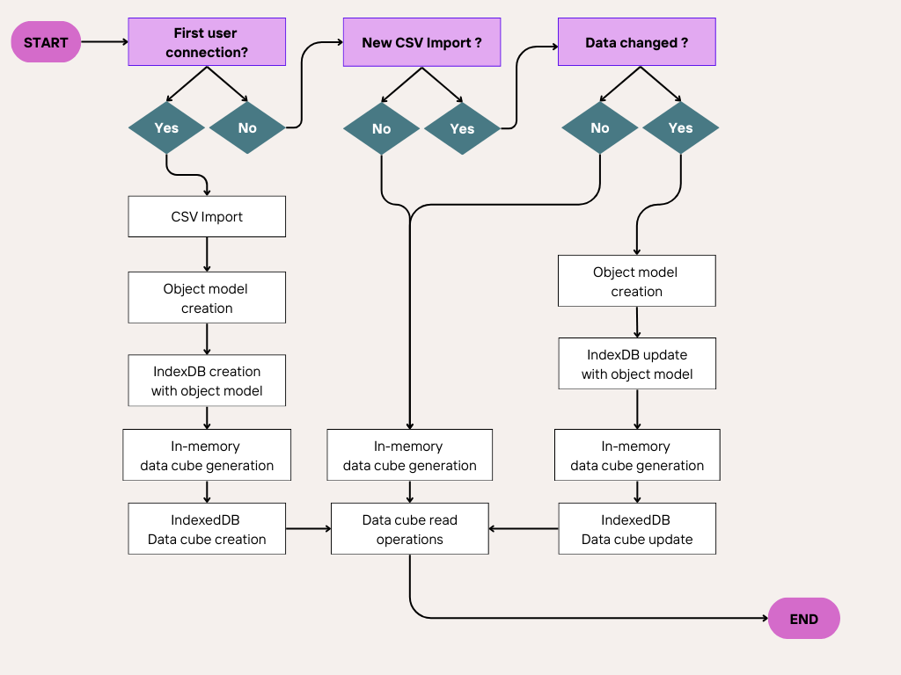

## <span style="color:#FFF;">A Locally Runnable Personal Budget Tracking & Financial Web Application</span>

This application is designed for two main types of users, each with distinct needs but a shared goal: gaining full control over their finances.

---

## <span style="color:#FFF;">For Individuals</span>

If you're looking for a reliable way to monitor your **income** and **expenses**, this tool provides:

- Clear categorization of expenses  
- Period‑based filtering  
- Synthetic and comprehensive charts for quick insights  
- Key financial indicators such as **end‑of‑month account balances**

These features help you understand your money flow, detect inconsistencies, and improve your overall capital management.

---

## <span style="color:#FFF;">For Investors</span>

If you want a consolidated view of your **assets**, the application enables you to:

- Group assets by class and visualize portfolio allocation  
- Track portfolio performance using multiple metrics, including **MRR** over weeks, months, or years  

---

## <span style="color:#FFF;">Shared Features</span>

Both individuals and investors benefit from:

- A complete **patrimony overview**  
- The ability to analyze its **evolution over any chosen period**

---

## <span style="color:#FFF;">How to Use It</span>

1. Export your bank and brokerage account data and format it as required  
2. Place the data files in the designated repository  
3. Open the web application — and you're ready to go  

---

## <span style="color:#FFF;">Data Formatting — Opereations</span>

Export your bank data as a CSV file with the following structure:

`date;category;subcategory;label;expense;income;balance`


- **Date** — When the operation occurred, formatted as *DD/MM/YYYY*. Used for period filtering.  
- **Category** — Operation category. Available categories include:  
  - Alimentation & restaurants  
  - Achats & shopping  
  - Loisirs  
  - Logement & charges  
  - Santé
  - Don  
  - Impôts, taxes & frais  
  - Transports  
  - Voyages  
  - Epargne & placements  
  - Note de frais  
- **Subcategory** — Operation subcategory. *(To be filled.)*  
- **Expense** — Expense amount if applicable; otherwise empty.  
- **Income** — Income amount if applicable; otherwise empty.  
- **Balance** — Account balance after the operation.

---

## <span style="color:#FFF;">Operations Data Sample</span>

```CSV
date;catégorie;sous-catégorie;libellé;débit;crédit;solde
31/01/2026;Balance;Balance;Balance;;;9999.99
02/01/2026;Alimentation & restaurants;Supermarché, épicerie;Myfunmarket;20.13;;
29/01/2026;Revenu;Salaire;MySocietyName;;1222.22;
```
---
## <span style="color:#FFF;">Data Formatting — Assets </span>

Export your brokerage data as:

`date;category;subcategory;description;location;value;invested`


- **Date** — Account status date, formatted as *DD/MM/YYYY*.  
  Ensure at least one entry exists for the last day of each month.  
- **Category** — Asset category:  
  - Crypto  
  - Actions & Fonds  
- **Description** — Any additional information not covered by previous fields.  
- **Location** — Where the asset is held (online wallet, brokerage account, retirement plan, etc.).  
- **Value** — Total account value (liquidation value + cash + more).  
- **Invested** — Total invested amount.

---

## <span style="color:#FFF;">Assets Data Sample</span>

```CSV
date;categorie;sous-categorie;description;emplacement;valeur;investissement
31/01/2023;Actions & Fonds;Brkrge acc. 1;Description;Bank Asset Mangmnt;999.99;888.88
```

---

## <span style="color:#FFF;">Data life cycle</span>

